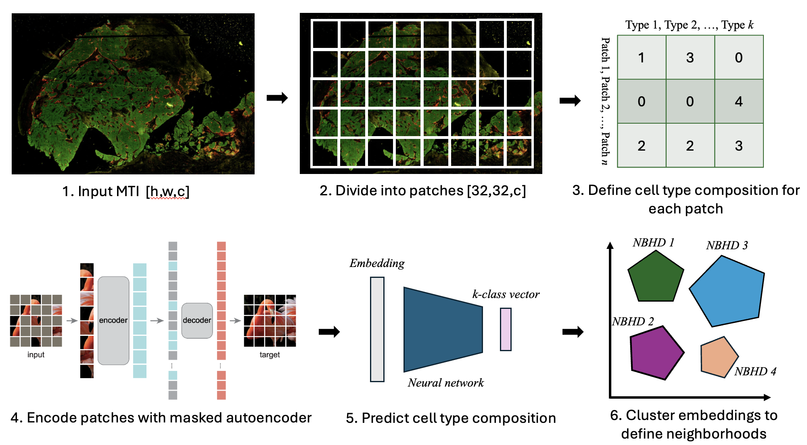

# Deep learning for cell neighborhood detection in multiplex tissue images
Eric Cramer, Emma Dyer, Hugh Galloway, Robert Heussner, Sanghoon Lee, Yi-Chien Wu  
NCI Human Tumor Atlas Network Data Jamboree | Nov. 6-8, 2024

**Introduction**
-------
Traditional multiplex imaging analysis pipelines produce cell types and downstream cell neighborhoods based on time-consuming cell segmentation and typing. Cell typing can often be thrown off by errors in segmentation which are particularly easy to make in the modality of multiplex imaging, and these issues propagate to neighborhood assignment. Additionally, neighborhood detection methods rely on featurized images and inherently do not consider cell morphology, staining patterns, and spatial orientation relative to other cells. We propose to model the raw imaging data with self-supervised computer vision approaches (masked autoencoder) and to demonstrate that the model can encode information like cell neighborhoods from imaging data alone.

**Goals**
-------
- Encode image patches from whole-slide images. Assign marker positivity to individual patches, via marker intensity. Use patch embeddings as inputs to train a classifier for marker positivity (i.e. tumor enriched regions, immune low regions, etc.)
- Assign RCNs to the labeled patches, then cluster the embeddings and compare the labeled RCNs with those automatically uncovered by the patch embeddings.
- Label image regions, based on region examples shown in the MINERVA stories. Use multi-instance learning to predict region labels based on the set of embeddings in each region. 

**Methods**
-------

## Code

## Results

**Acknowledgements**
