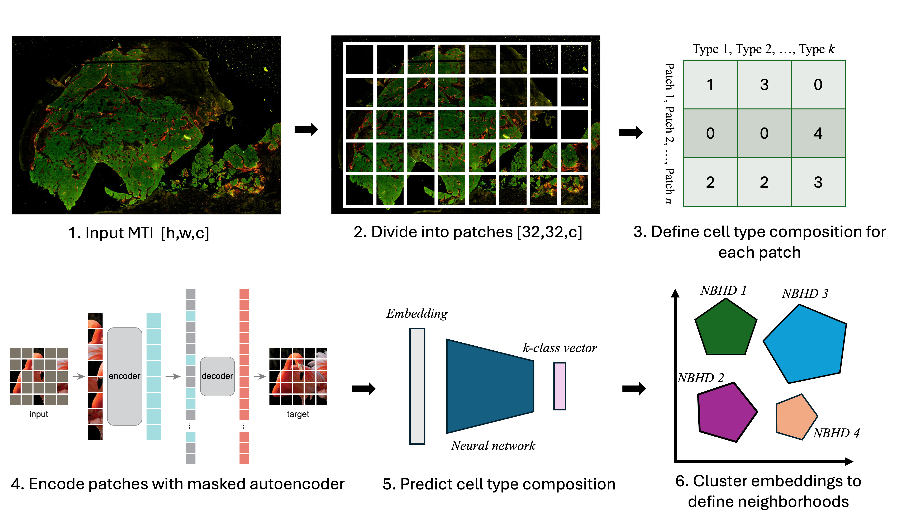
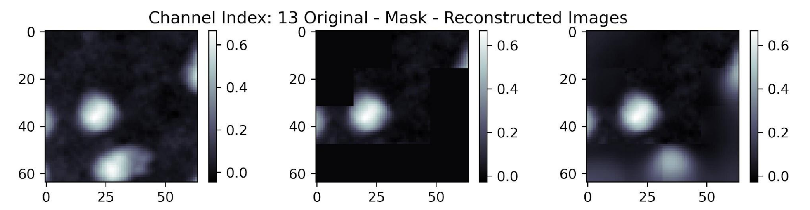
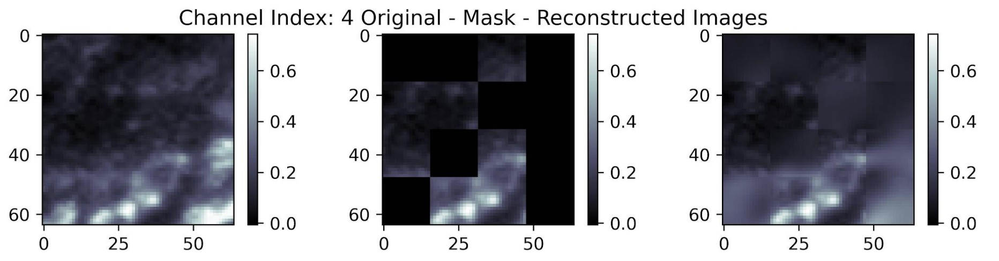
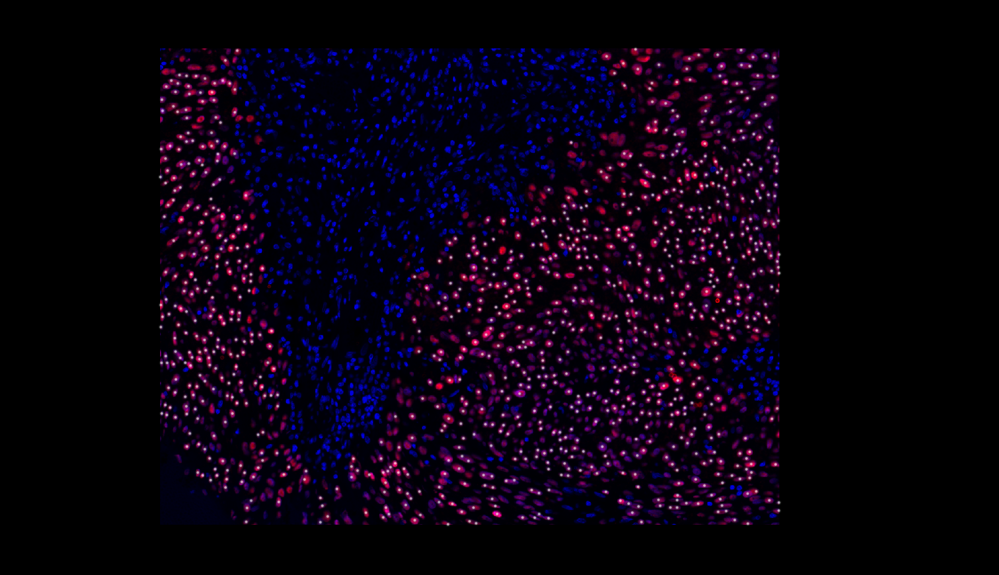
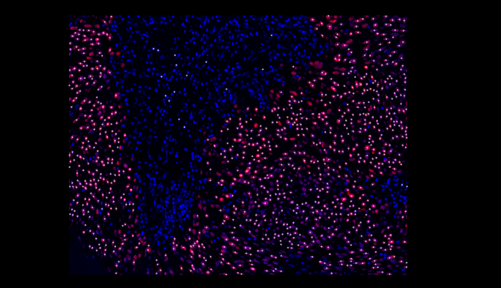
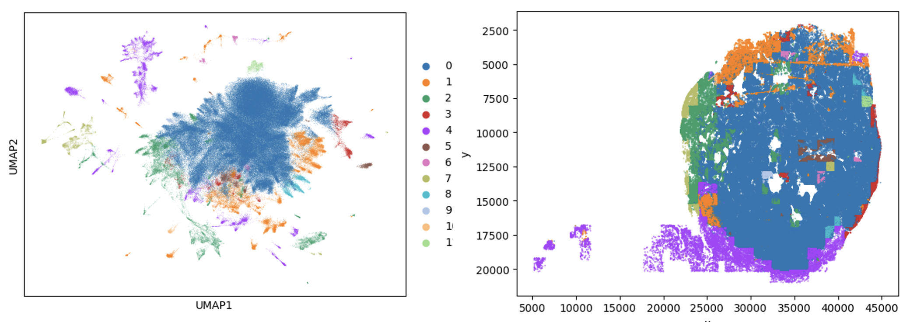

# Deep learning for cell neighborhood detection in multiplex tissue images
### NCI Human Tumor Atlas Network Data Jamboree | Nov. 6-8, 2024
**Eric Cramer, Emma Dyer, Hugh Galloway, Robert Heussner, Sanghoon Lee, Yi-Chien Wu**

## Introduction
Traditional multiplex tissue imaging (MTI) analysis pipelines produce cell types and downstream recurrent cell neighborhoods (RCNs) based on time-consuming cell segmentation and typing. Cell type assignment can often be thrown off by errors in segmentation which are particularly easy to make in the modality of multiplex imaging, and these issues propagate to neighborhood detection. Additionally, neighborhood detection methods rely on featurized images and inherently do not consider cell morphology, staining patterns, and spatial orientation relative to other cells. We propose to model the raw imaging data with a masked autoencoder (MAE) and to demonstrate that the model can encode information like cell neighborhoods from imaging data alone. We also plan to compare common neighborhood detection methods with our embedding-based approach to understand if adding the pixel information can improve neighborhoods for downstream uses. 

## Goals 
1. Demonstrate the MAE can learn faithful representations of MTI patches.
2. Phenotype the cells and train a classifier to predict marker positivity in each patch.
3. Assign RCNs to the image patches and cluster the MAE embeddings. Compare the labeled RCNs with those automatically uncovered by the patch embeddings.

## Whole-Slide Image Processing and Self-Supervised Modeling of Patches
1. To convert whole-slide images into collections of regions we run the file `roi_sampler.py`. This file acceps a path to a whole slide image and also a single-cell table. We take (1000,1300) pixel regions from the whole-slide images and keep all regions which have more than 1000 cells present. This is a tissue foreground segmentation.
2. There are several files in this repository that handle patch extraction from the regions. Those are `general_patch_extractor.py`, `parallel_patch_extractor.py`, and `parallel_cell_patch_extractor.py`. All patch extractors take image region files convert them into fixed size patches, in our case we use (64,64) patches. This is also where we perform image normalization, in our case we perform mean division across channels and then take the log10 transform for all image intensities. The `general_patch_extractor.py` file takes regions sequentially, the `parallel` files just injest a single region and region name, such that you can leverage parallel processing through platforms like NextFlow. The `parallel_cell_patch_extractor.py` file centers the patches on individual cells, which we leveraged for cell type prediction on the image embeddings. We did not train on these patches, but instead on the evenly spaced tiles from `parallel_patch_extractor.py`
3. The file `patch_pretrain.py` trains a masked autoencoder model (vision transformer based model) on the reconstruction task for a folder of all patches. It accepts an argument for the number of channels and includes an option to subset the channels based on a file that holds channels that the user wants to train on. We use a masking ratio of 50% and take 16x16 tiles within each patch to define the tokens passed into the model. 
4. We then extract embeddings for all patches using the file `extract_embeddings.py` which passes every patch into the trained model and saves an anndata object that holds all the embeddings and the metadata associated with every embedding.
5. To view examples of model reconstruction, we use the `ssl_recon_viz.py` file which produces a user defined number of reconstruction examples in the format of (input, masked input, reconstructed output)

## Methods
  
The idea is to take an input MTI **(1)**, break it up into small patches **(2)** and assign cell type labels based on the marker expression **(3)**. Next, we can embed the MTI patches with a masked autoencoder **(4)** and use those embeddings to predict the cell type composition of the patches **(5)**. Finally, we can cluster the embeddings and compare the neighborhoods we discover versus typical recurrent neighborhood analysis results **(6)**. 

- We chose a single MTI (Sample ID: Mel01_3_1) from a [malignant melanoma study](https://aacrjournals.org/cancerdiscovery/article/12/6/1518/699151/The-Spatial-Landscape-of-Progression-and) that can be found on the HTAN data portal [here](https://humantumoratlas.org/explore?selectedFilters=%5B%7B%22value%22%3A%22CyCIF%22%2C%22group%22%3A%22assayName%22%2C%22count%22%3A5139%2C%22isSelected%22%3Afalse%7D%2C%7B%22value%22%3A%22Malignant+melanoma+NOS%22%2C%22group%22%3A%22PrimaryDiagnosis%22%2C%22count%22%3A44%2C%22isSelected%22%3Afalse%7D%5D).
- For a description of **(1)**, **(2)**, and **(4)**, refer to the above section.
- The process for **(3)** is shown in `manual_fk_gating.ipynb`, where we used [flowkit](https://github.com/whitews/FlowKit) and manually gated markers.
- For clustering in **(6)**, refer to `gpu_clustering.ipynb` notebook where we used [GPU-accelerated Louvain algorithm](https://rapids-singlecell.readthedocs.io/en/latest/) to cluster our 600,000 cell dataset in 10s! 

## Results
**MAE training**
We performed model pretraining on a subset of 15 channels which were used in the cell phenotyping. Examples of the model reconstruction after training were shown below. There tend to be artefacts around the masked tiles, which is common for masked autoencoders, but broadly the model does a good job of understanding the structure of intensity patterns, even across very hetergeneous channels. 

 

**Cell type assignment**  
We found automatic and manual gating tumor cell type assignments aligned well with SOX10 expression in the original image.

| Automatic Gating Result  | Manual Gating Result |
| ------------- | ------------- |
|   |   |

**Cell type prediction**  
**Embedding exploration**  
We projected the patch embeddings into a UMAP to visually compare the manual and automatic cell type assignments
  
We also performed unsupervised clustering on the patch embeddings and mapped the cluster assignments back onto the original image

## Problems
- To scale the project up, we needed accurate cell labels for each image. We had to assign cell types to all cells in the image based on our limited biological knowledge of the Melanoma WSI we chose to use.
- We spent a decent portion of time learning how to use the ISB-CGC cloud resource to analyze our large dataset of over 600k cells! 
- The neighborhoods we detected are inherently linked to the patch size, which can be arbitrarily defined.
 
## Future directions
1. Explore the impact of patch size on neighborhood detection.
2. Mask out border cells to ensure the cells are fully contained in each patch.
3. Evaluate the downstream effects (patient outcome, ROI identification) of defining neighborhoods directly from raw images as opposed to traditional RCN.
