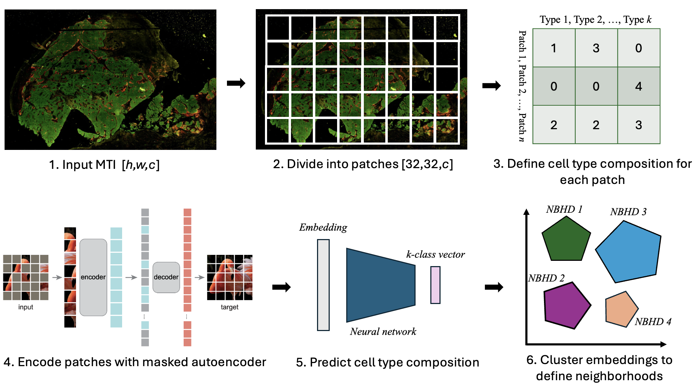
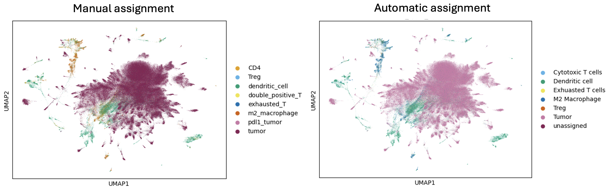

# Deep learning for cell neighborhood detection in multiplex tissue images
### NCI Human Tumor Atlas Network Data Jamboree | Nov. 6-8, 2024
**Eric Cramer, Emma Dyer, Hugh Galloway, Robert Heussner, Sanghoon Lee, Yi-Chien Wu**

## Introduction
Traditional multiplex tissue imaging (MTI) analysis pipelines produce cell types and downstream recurrent cell neighborhoods (RCNs) based on time-consuming cell segmentation and typing. Cell type assignment can often be thrown off by errors in segmentation which are particularly easy to make in the modality of multiplex imaging, and these issues propagate to neighborhood detection. Additionally, neighborhood detection methods rely on featurized images and inherently do not consider cell morphology, staining patterns, and spatial orientation relative to other cells. We propose to model the raw imaging data with a masked autoencoder (MAE) and to demonstrate that the model can encode information like cell neighborhoods from imaging data alone. We also plan to compare common neighborhood detection methods with our embedding-based approach to understand if adding the pixel information can improve neighborhoods for downstream uses. 

## Goals 
1. Demonstrate the MAE can learn faithful representations of MTI patches.
2. Phenotype the cells and train a classifier to predict marker positivity in each patch.
3. Assign RCNs to the image patches and cluster the MAE embeddings. Compare the labeled RCNs with those automatically uncovered by the patch embeddings. 

## Methods
  
**Figure 1: Method overview**. The idea is to take an input MTI **(1)**, break it up into small patches **(2)** and assign cell type labels based on the marker expression **(3)**. Next, we can embed the MTI patches with a masked autoencoder **(4)** and use those embeddings to predict the cell type composition of the patches **(5)**. Finally, we can cluster the embeddings and compare the neighborhoods we discover versus typical recurrent neighborhood analysis results **(6)**. 

- We chose a single MTI (Sample ID: Mel01_3_1) from a [malignant melanoma study](https://aacrjournals.org/cancerdiscovery/article/12/6/1518/699151/The-Spatial-Landscape-of-Progression-and) that can be found on the HTAN data portal [here](https://humantumoratlas.org/explore?selectedFilters=%5B%7B%22value%22%3A%22CyCIF%22%2C%22group%22%3A%22assayName%22%2C%22count%22%3A5139%2C%22isSelected%22%3Afalse%7D%2C%7B%22value%22%3A%22Malignant+melanoma+NOS%22%2C%22group%22%3A%22PrimaryDiagnosis%22%2C%22count%22%3A44%2C%22isSelected%22%3Afalse%7D%5D).
- For **(1)** and **(2)**, we used X 
- The process for **(3)** is shown in `manual_fk_gating.ipynb`, where we used [flowkit](https://github.com/whitews/FlowKit) and manually gated markers.
- To accomplish **(4)** we implemented the MAE in PyTorch `folder`
- 
- For clustering in **(6)**, refer to `gpu_clustering.ipynb` notebook where we used [GPU-accelerated Louvain algorithm](https://rapids-singlecell.readthedocs.io/en/latest/) to cluster our 600,000 cell dataset in 10s! 

## Results
**MAE training**
**Cell type assignment**
**Cell type prediction**
**Embedding exploration**  
We projected the patch embeddings into a UMAP to visually compare the manual and automatic cell type assignments (Figure 3)
  
We also performed unsupervised clustering on the patch embeddings and mapped the cluster assignments back onto the original image (Figure 4)

## Problems
- To scale the project up, we needed accurate cell labels for each image. We had to assign cell types to all cells in the image based on our limited biological knowledge of the Melanoma WSI we chose to use.
- We spent a decent portion of time learning how to use the ISB-CGC cloud resource to analyze our large dataset of over 600k cells! 
- The neighborhoods we detected are inherently linked to the patch size, which can be arbitrarily defined.
 
## Future directions
1. Explore the impact of patch size on neighborhood detection.
2. Mask out border cells to ensure the cells are fully contained in each patch.
3. Evaluate the downstream effects (patient outcome, ROI identification) of defining neighborhoods directly from raw images as opposed to traditional RCN.
